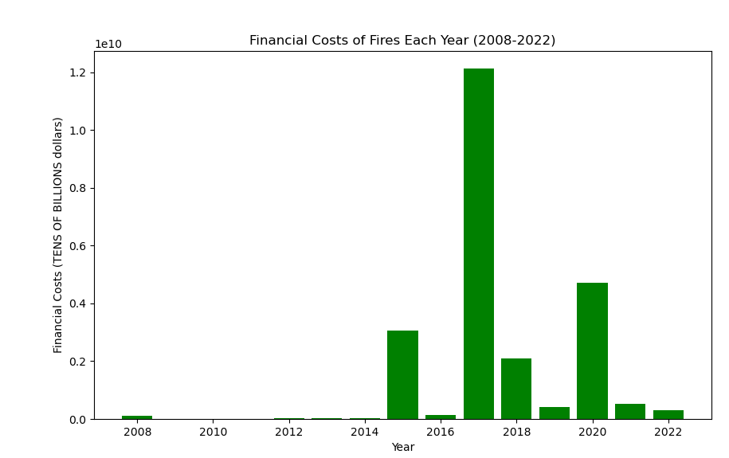
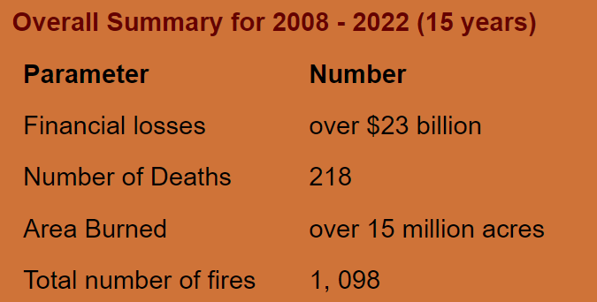

# The Growing Threat of Wildfires: Urgent Actions and Impacts

## Project Partners:

* [Theresa F.](https://github.com/TheresaFregoso)
* [Scott J.](https://github.com/UtahPando)
* [Sabrina L.](https://github.com/LegallyNotBlonde)
___

## Project Tracker Overview

* We started with the original data in PDF format, with each year in a separate file. 
* Using code, we extracted this data into Excel, parsed the relevant pages, and transformed it into key metrics using Pandas libraries. 
* We then created an SQL schema to store the data and used JavaScript to build HTML pages with interactive dashboards. 
* Pandas was also used for various visualizations. Due to our group's limited size and time constraints, we divided the project into smaller tasks, allowing us to work in parallel. 
* This approach has led to multiple code files in this repository.

### Purpose

* This project highlights the severe impact of wildfires in California from 2008 to 2022, with data-driven insights on frequency, damage, and risk areas.
* While initially educational, the findings reveal a need for immediate action to mitigate the escalating threat of wildfires.

___

### Key Findings and Charts

* Acres Burned: 2020 and 2018 saw unprecedented spikes, indicating more severe wildfires.
* Financial Costs: 2017 marked a peak, with fires costing over $12 billion, emphasizing the economic devastation.
* Median Fire Duration: Notably high in 2016, 2020, and 2022, suggesting prolonged fires contribute significantly to overall damage.
* Total Deaths: 2018 was particularly deadly, underscoring the human cost of these disasters.

#### *Please find more details in the [separate presentation](https://docs.google.com/presentation/d/18218T6EQrjeQu0vUXJoN1WikxMXPLT6Y-v4c-PHHHL0/edit#slide=id.g2815e3fa5e3_0_54) included in this repo.*

### Actionable Steps
* **Home Fireproofing**: Visit the **[CAL FIRE Ready](https://readyforwildfire.org)** for Wildfire page for tips on using fire-resistant materials and creating defensible spaces around your property.
* **Grant Opportunities:** Check the **[Grants and Funding page](https://cafiresafecouncil.org/)** to see if you qualify for grants, including those from the **[Marin Wildfire](https://www.marinwildfire.org/)** Prevention Authority.
* **Advocacy:** Advocate for stronger fire prevention policies by pushing local and federal governments to invest in forest management, public education, and soil moisture improvement strategies.

___

### Conclusion
The data underscores the unpredictable nature of wildfires and their increasing severity. While the frequency of fires fluctuates, the damage—both economic and human—demands urgent and sustained preventive measures. Now is the time to take action to protect lives and properties from future catastrophes.
___

### Key Takeaway for Viewers

This project, while independent and exploratory, offers valuable insights:
    
 * **County-Level Risk Assessment:** Access localized fire statistics and risk assessments here. You can check information about your county (slide 8 of our presentation).
    
 * **Economic Impact:** In **2017**, California's fires cost over **$12 billion**. From **2008-2022, total damages exceeded $24 billion**, excluding human and environmental costs, and costs of containing fires.
    
 * Yearly Statistics please look at the highlights above and check our presentation or html page for more information.
    
 * **Policy Implications:** Advocate for stronger preventative measures at local and state levels. While costly, these measures could be more cost-effective than facing devastating wildfire damages.
    
 * **Real Estate Considerations:** When buying property in California, consider fire risks alongside other factors like earthquakes, as they significantly impact insurance costs.
___

### Ethical Consideration

* **Data Integrity:** We maintained a strong focus on accuracy, transparency, and ethical data handling throughout the project.

* **Limitations:** The dataset mainly covers larger fires (300+ acres), which might exclude smaller yet impactful events. Repeated fire names across counties and inconsistent fire duration data present challenges, but our focus on yearly trends mitigates these issues.

*This project is licensed under the GNU General Public License v3.0. For more details, please refer to the 'LICENSE' file.*
___

### Methodologies and Programming Languages Used
* Pandas libraries 
* Python (including but not limited to '**Flask**', '**pdfplumber**', '**stats**, and '**ast**' (the latter was used to process trees of the Python abstract syntax grammar)).
* SQL 
* JavaScript
* To initiate the dynamic visualization using Flask, navigate to Fire-Analysis/MapVisualizations folder, run python app.py, and open the **[HTML page](http://127.0.0.1:5000/)**

___

### Repo Structure

* **Files with codes** have **self-explanatory names** and are available in the main body of the repo.

 * Here is the right order to read/execute the files: *

1. ***FirePerimeter_data_extract.ipynb*** - json to extract data from the source and create a map
2. ***scrapePDFforTables.ipynb*** - pandas code to scrape data from pdf sources into excel files
3. ***CA_wildfire_data_ETL.ipynb*** extracting data from xls files for 2020-2022
4. ***cleaning_extracting_data_for_2008-2022.ipynb*** - pandas libraries to extract data for 2008-2019, combine with 2020-2022, clean the data, and check fire distribution
5. ***USD_Impact_data_ETL.ipynb*** calculates financial impact of fires
6. ***USD_Impact_data_ETL2.ipynb*** calculates financial impact of fires
7. ***calculating_key_metrics_for_visualization_pandas.ipynb*** calculates fire numbers, median durations, the number of deaths, and the total damages both by month and by year
8. ***yearly_kpi_plots.ipynb*** - pandas code to create yearly plots to show fire trends during the analysed period
9. ***CreateDataBase.ipynb*** create and query SQLite database
10. ***CombineDataset.ipynb*** merge and analyze county data
11. ***FireStatsToMapPrep.ipynb*** convert statistical data for map usage
12. png files are attached to display some graphs in the Readme file.

13.  ***Files with codes*** to create **interactive map and charts** are located in [MapVisualizations](https://github.com/LegallyNotBlonde/Fire-Analysis/tree/main/MapVisualizations) folder.
14. ***[Google Slides (PowerPoint) presentation](https://docs.google.com/presentation/d/18218T6EQrjeQu0vUXJoN1WikxMXPLT6Y-v4c-PHHHL0/edit#slide=id.p)*** contains comprehensive project details, graphs, and **chart analysis in speaker notes**. The accompanying PDF presentation called ***"The_Growing_Threat_of_Wildfires.pdf"*** mirrors the presentation, excluding the speaker notes.

* **[Resources folder](https://github.com/LegallyNotBlonde/Fire-Analysis/tree/main/Resources)** contains original, raw data sets.
* **[Outputs](https://github.com/LegallyNotBlonde/Fire-Analysis/tree/main/Outputs)** includes transformed data and tables.
* **[Charts](https://github.com/LegallyNotBlonde/Fire-Analysis/tree/main/Charts)** folder contains various visualization displays.

___

### Resources
* [California State Geoportal](https://gis.data.ca.gov/).
* [Youtube Link](https://www.youtube.com/watch?v=VEtICDT_ZmI) to display fire siren created by [Kermit the sound](https://www.youtube.com/@kermitthesound389).
* AdobeStock - Image for the title presentation page.
* We used ChatGPT and Google.com to verify fire details during cleaning and validating our data.
* ChatGPT provided an idea for 'ast' library to process trees of the Python abstract syntax grammar.